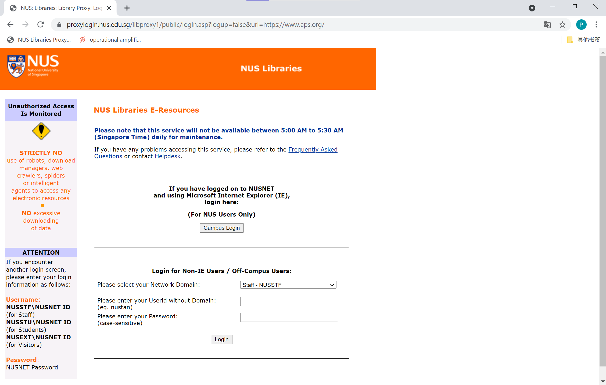

# NUS-FastLibProxy
An extension that saves time logging into the NUS libproxy

## What's it for? 

Each time we need to download an article from NUS library using proxy from bookmarklet (e.g. from [this](https://libfaq.nus.edu.sg/faq/71316) tutorial), we're prompted to provide the username and password. 

To make matters worse for students, we also need to change the default domain from NUSSTF to NUSSTU. After clicking "Login", we also need to agree the "NUS Libraries E-Resources Appropriate Use Policy" every time. All the above fusses will be gone with **NUS-FastLibProxy**. 

## How to use? 

Download the ``NUS-FastLibProxy`` folder. Edit ``background.js`` with your username and password, and install the extension (say, by navigating to ``chrome://extensions`` page and drag the editted folder into the chrome window). After this, each time you click the ``NUS Libraries Proxy Bookmarklet`` as before, the two stages of login will be done automatically for you. 